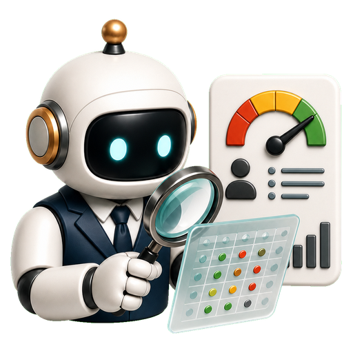
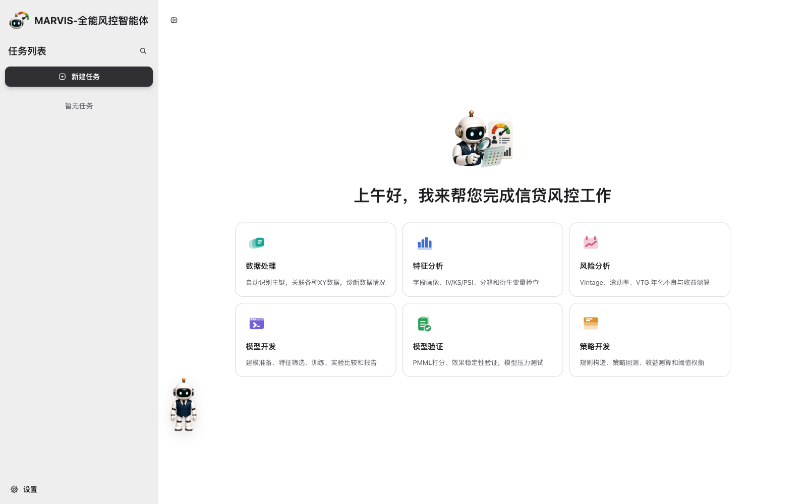
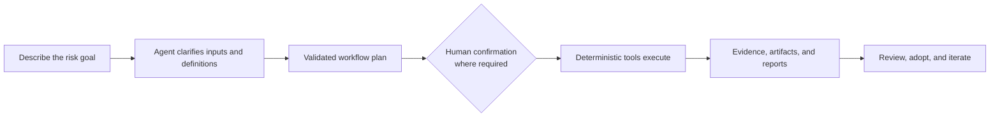

<p align="center">
  
</p>

<h1 align="center">MARVIS-Agent</h1>

<p align="center">
  <strong>Tell MARVIS what risk decision you need.</strong><br />
  It turns local data into governed analysis, models, strategies, and audit-ready deliverables.
</p>

<p align="center">
  <a href="https://github.com/eddyzzl/marvis-risk-agent/actions/workflows/ci.yml"></a>
  <a href="https://github.com/eddyzzl/marvis-risk-agent/tags"></a>
  
  <a href="LICENSE"></a>
</p>

<p align="center">
  <a href="README.md"><strong>English</strong></a>
  ·
  <a href="README.zh-CN.md">中文</a>
</p>

<p align="center">
  
</p>

<p align="center"><em>One workbench for local risk analysis and development—from data to strategy and reports.</em></p>

---

## From a request to a reviewable result

MARVIS is a local-first, governed credit-risk Agent platform—not a chatbot
wrapped around a collection of scripts.

Describe the business outcome in natural language. MARVIS asks for missing
files and definitions, builds a reviewable plan, pauses at responsibility
gates, runs deterministic tools, and returns real datasets, evidence, models,
strategy code, and reports.



### What the current V2 delivers

- **A complete seven-step strategy-development workflow**: current and
  historical evidence, governed dual-population samples, univariate and model
  evidence, trees, Cross, scorecards, Voting, Strategy Pools, impact
  measurement, validation, code delivery, and four-format review reports.
- **A governed data-to-model workflow**: ingest and join files, analyze and
  engineer features, train and compare multiple recipes, export PMML, score
  data, generate model reports, and hand the selected model and supporting
  evidence directly into model validation. PMML export is available for
  supported recipes.
- **Conversational risk analysis**: MARVIS first asks what to analyze and which
  fields, units, dates, scenarios, and assumptions apply. It then runs the
  selected VTG-terminal/annualized-bad-rate or profitability calculation and
  delivers an audited Excel report. Standard Vintage and roll-rate are separate
  governed workflows with structured evidence and artifacts.

## Why risk teams use MARVIS

<table>
  <tr>
    <td width="25%"><strong>Work in business language</strong><br />Start with the decision you need, not a hand-built chain of scripts and notebooks.</td>
    <td width="25%"><strong>Trust the numbers</strong><br />KS, AUC, PSI, bad rate, approval rate, profit, and impact are calculated by deterministic platform code—not guessed by an LLM.</td>
    <td width="25%"><strong>Keep data close</strong><br />Files, task state, evidence, and outputs stay in a controlled local workspace by default.</td>
    <td width="25%"><strong>Retain human responsibility</strong><br />High-impact actions pause for confirmation, and key governed results carry lineage and audit evidence.</td>
  </tr>
</table>

Agent mode and the Manual Workbench share the same validated workflows, tools,
schemas, and deterministic calculation kernels.

| A fragmented workflow | With MARVIS |
|---|---|
| Requirements, scripts, notebooks, screenshots, and reports live in different places. | The request, plan, execution evidence, decisions, and deliverables stay in one task. |
| Analysts manually reconnect data, feature, model, strategy, and report steps. | Governed workflows carry task ownership, data fingerprints, parameters, and artifacts forward. |
| AI can explain an answer, but it is hard to prove where the number came from. | Agent explanations point back to deterministic evidence and auditable memory references. |
| A result is copied into a document and loses its lineage. | Reports and code are generated from structured, versioned platform results. |

## One workbench for end-to-end local risk analysis and development

| Module | What MARVIS can do | Typical deliverables |
|---|---|---|
| **Data processing** | Register CSV/Excel files, infer schemas, profile data, align columns, propose and confirm joins, diagnose match rate, fan-out and row inflation, deduplicate explicitly, run governed transformations, and export safely. | Derived datasets, join evidence, profiling summaries, CSV/XLSX exports |
| **Labels, samples, and features** | Define bad labels from DPD plus observation and performance windows, check cohort maturity, design development/validation/OOT samples, calculate IV/KS/AUC/PSI/Lift/Coverage, bin numeric and categorical features, analyze correlation and collinearity, encode, impute, cap, and derive features. | Feature evidence, governed sample definitions, selected feature sets, Excel reports |
| **Model development** | Build binary, regression, and multiclass recipes; check modeling readiness; run governed reject inference with explicit assumptions and sample weights; prepare leakage-aware splits; resolve special values; select features; tune and train multiple recipes; compare experiments; select and calibrate a model; assess segment value; score datasets; and create monitoring handoffs. | Experiments, score evidence, model reports, scored data, PMML for supported recipes, model cards and handoff packages |
| **Model validation** | Scan Notebook, sample, PMML, and dictionary materials; execute the Notebook; compare in-memory model scores with submitted PMML scores; calculate performance, stability, score consistency, binning, and stress evidence; keep both manual and Agent-assisted paths available. | Structured validation evidence, Excel and Word reports |
| **Strategy development** | Design approval and risk populations; analyze variables and models; build and refine approval, reject, limit, pricing, and segmentation rules; use automatic and interactive trees, 2D Cross Matrix, 2D/3D cross-threshold search, scorecard cutoffs, and Voting/n-of-k combinations; compile Strategy Pools; measure impact and stability; validate on independent partitions; and adopt local versions through human gates. | Canonical strategies, backtests, ImpactCube evidence, Python/DuckDB SQL/JSON code, JSON/Markdown/XLSX/DOCX reports |
| **Vintage and risk analysis** | After confirming fields, units, cut-off dates, scenarios, and assumptions, run the selected VTG-terminal/annualized-bad-rate or profitability calculation. Run Standard Vintage and roll-rate as separate governed analyses with bounded cohort/segment evidence. | Audited risk-analysis Excel reports; structured Vintage and roll-rate evidence, charts, assumptions, conclusions, and red flags |
| **Monitoring and portfolio analytics** | Monitor score and feature stability, strategy thresholds and disposition, turn red monitoring evidence into a governed new-version task, and use implemented portfolio tools for flow rate, bucket migration, segments, concentration, Expected Loss, stability trends, and limit/pricing trade-offs. | Monitoring evidence, portfolio reports, migration tables, pricing matrices |
| **Agent, governance, and memory** | Clarify intent, instantiate validated workflows, enforce task ownership and confirmation gates, preserve hashes and provenance, and reuse bounded memories about preferences, field definitions, prior performance, and known pitfalls—with source and audit metadata. | Reviewable plans, evidence envelopes, audit history, traceable memory references |

The six primary desktop entries are Data Processing, Feature Analysis, Risk
Analysis, Model Development, Model Validation, and Strategy Development.
Monitoring is integrated into model and strategy workflows. Portfolio tools,
templates, and report rendering are implemented and tested, but portfolio is
not currently exposed as a first-screen or supported conversational Agent task.

## Strategy development, end to end

Strategy work is where MARVIS goes furthest beyond “AI assistance.” The current
V2 workflow follows the real seven-step development process:

1. **Understand the current project** — approval rate, risk level, profitability,
   population, metric definitions, and known constraints.
2. **Review historical versions** — compare prior strategy evidence, outcomes,
   assumptions, and reusable lessons.
3. **Design the sample** — create governed approval and risk populations,
   development/validation/OOT partitions, maturity rules, labels, weights, and
   immutable membership evidence.
4. **Evaluate variables and models** — produce deterministic univariate,
   score-band, model, lift, stability, and risk evidence.
5. **Develop combinations** — build and refine single rules, automatic and
   interactive trees, 2D Cross Matrix, 2D/3D cross-threshold searches,
   scorecards, and Voting/n-of-k candidates for approval, reject, limit,
   pricing, and segmentation in a common Strategy Pool.
6. **Measure impact** — replay the strategy by month, segment, amount, and
   partition; compare approval rate, bad rate, swap, and risk; measure
   profitability where the required economics are available; and run stability
   and independent validation checks.
7. **Deliver the review package** — materialize a canonical strategy, verify
   equivalent Python/DuckDB SQL/JSON execution, and generate
   JSON/Markdown/XLSX/DOCX reports aligned to a seven-section strategy review.

If optional report information is unavailable, MARVIS asks for it. When the
user explicitly says it is not currently available, the report keeps that
field blank instead of inventing content.

## Example requests

You can start with requests like:

> Join the application table with the bureau features. Check key precision,
> duplicate keys, match rate, and row inflation before asking me to approve the
> join.

> Compare logistic regression, LightGBM, and a scorecard. Keep an OOT sample,
> explain leakage risks, and do not select the champion until I confirm.

> Build a new-customer approval strategy with bad rate no higher than 5% and
> approval rate at least 60%. Ask me for anything needed before you design the
> sample.

> Calculate VTG terminal and annualized bad rate. First list the tables,
> columns, units, cut-off date, scenario, and assumptions you need from me.

## Outputs, not just chat

Depending on the workflow, MARVIS produces:

- immutable derived datasets and safe CSV/XLSX exports;
- feature evidence and downloadable feature-analysis workbooks;
- experiment comparisons, scored data, PMML, model cards, monitoring policies,
  and model-development reports;
- validation evidence and Excel/Word validation reports;
- canonical strategy assets, versioned backtests, ImpactCube and stability
  evidence, equivalent Python/DuckDB SQL/JSON implementations, and four-format
  review bundles;
- audited VTG/annualized-bad-rate or profitability Excel reports, plus
  structured Vintage, roll-rate, monitoring, and portfolio artifacts;
- provenance, hashes, confirmation records, tool-run logs, and auditable memory
  references.

## Responsible automation

MARVIS automates work without pretending that responsibility disappeared:

- The Agent understands, clarifies, plans, summarizes, and explains.
- Platform tools own deterministic metrics, rules, sample membership,
  backtests, impact calculations, and report numbers.
- Strategy adoption, high-risk monitoring actions, and production changes
  require explicit human authority. **Local adoption is not production
  deployment.**
- Memory can suggest context or warn about a prior pitfall, but it cannot change
  KS, AUC, PSI, bad rate, score consistency, or any other deterministic result.
- Raw customer rows, full model files, PMML contents, credentials, private
  reports, and database connections are excluded from Agent memory.
- Code paths and CI are verified, but real-project acceptance still requires
  representative business materials, agreed metric definitions, independent
  reconciliation, and responsible-party sign-off.
- Current V2 is a local-first workbench. Full multi-user RBAC, production
  promotion/rollback, real-time decision-engine integration, and cross-device
  synchronization must not be inferred from the local workflow.

See the [product roadmap](docs/roadmap.md) for the precise current scope and V2
delivery boundary.

## Quick start

Source installation supports Python 3.11–3.13; Python 3.12 is recommended for a
new environment.

```bash
git clone https://github.com/eddyzzl/marvis-risk-agent.git
cd marvis-risk-agent
python -m venv .venv
source .venv/bin/activate
python -m pip install -U pip
python -m pip install -e .
marvis
```

Open `http://127.0.0.1:8000/`.

On Windows, activate the environment with `.venv\Scripts\activate` instead.
When a release includes `MARVIS-Setup-<version>-win-x64.exe`, that asset provides
the one-click local installer without requiring a separate Python, Java, Git,
conda, WSL, or Docker installation.

PMML scoring requires a Java runtime compatible with `pypmml`. For material
directory permissions, Windows drives, WSL paths, conda setup, upgrades, and
deployment details, use the [runbook](docs/runbook.md).

To update a clean GitHub checkout:

```bash
marvis update
```

## Product and operator documentation

- [Roadmap](docs/roadmap.md) — product scope, current V2 boundary, and workflow terminology
- [Runbook](docs/runbook.md) — installation, startup, updates, material paths, and operations
- [Notebook contract](docs/notebook_contract.md) — model-validation Notebook runtime contract
- [Notebook submission requirements](docs/对notebook的要求.md) — requirements for model developers
- [Design](DESIGN.md) — product experience and interface decisions
- [Branding](docs/branding.md) — local customer branding without source-code changes
- [Versioning](docs/versioning.md) — release helper, versions, and tag rules
- [Review evidence](docs/reviews/) — implementation and code-review evidence

<details>
<summary><strong>Contributor checks and release commands</strong></summary>

```bash
# Fast local feedback
scripts/check --fast

# Small, mapped changes
scripts/check --affected

# Full release gate
scripts/check

# Publish a verified patch release
python scripts/release_push.py --bump patch
```

Pull requests use parallel fast-test shards plus quality, security, strategy,
and PMML gates. A manual CI dispatch runs the full, unfiltered release check.

</details>

## License

MARVIS-Agent is released under the [MIT License](LICENSE).
