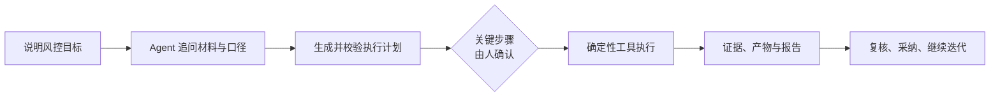

<p align="center">
  
</p>

<h1 align="center">MARVIS-Agent｜全能风控智能体</h1>

<p align="center">
  <strong>把信贷风控需求直接告诉 MARVIS。</strong><br />
  从一句业务需求，到一份可复核、可下载、可交付的风控结果。
</p>

<p align="center">
  <a href="https://github.com/eddyzzl/marvis-risk-agent/actions/workflows/ci.yml"></a>
  <a href="https://github.com/eddyzzl/marvis-risk-agent/tags"></a>
  
  <a href="LICENSE"></a>
</p>

<p align="center">
  <a href="README.md">English</a>
  ·
  <a href="README.zh-CN.md"><strong>中文</strong></a>
</p>

<p align="center">
  
</p>

<p align="center"><em>一个工作台，贯通本地风控分析与开发——从数据到策略与报告。</em></p>

---

## 从需求到结果

MARVIS 是本地优先、可治理的多工作流信贷风控 Agent 平台，不是给一堆脚本套上聊天窗口。

你只需要用自然语言说明想解决的业务问题。MARVIS 会主动追问缺少的材料和口径，
生成可检查的执行计划，在责任决策点暂停确认，再调用确定性工具完成计算，最后交付
真实的数据集、分析证据、模型、策略代码和报告。



### 当前 V2 已经交付的完整闭环

- **完整的策略开发七步闭环**：项目现状与历史证据、通过率/风险双总体样本、
  单变量与模型证据、自动树、交互树、Cross、评分卡、Voting、Strategy Pool、
  影响测算、独立验证、代码交付和四种格式的评审报告。
- **受治理的数据到模型整链**：文件登记与拼接、特征分析与工程、多配方训练与比较、
  数据打分、模型报告、监控交接和模型验证移交；受支持的模型配方可以导出 PMML。
- **对话式风险分析**：MARVIS 先问清楚要分析什么，以及表、字段、单位、截面、
  场景和假设，再按用户选择完成 VTG 终值/年化不良或收益测算，并生成受审计的
  Excel 报告；标准 Vintage 与滚动率是独立的受治理分析流程，输出结构化证据和产物。

## 为什么选择 MARVIS

<table>
  <tr>
    <td width="25%"><strong>直接说业务目标</strong><br />从“我要做什么决策”开始，而不是先手工拼出一串脚本和 Notebook。</td>
    <td width="25%"><strong>数字有据可查</strong><br />KS、AUC、PSI、坏账率、通过率、收益和影响均由平台确定性计算，不由大模型猜测。</td>
    <td width="25%"><strong>材料留在本地</strong><br />文件、任务状态、执行证据和交付产物默认保存在受控的本地 workspace。</td>
    <td width="25%"><strong>关键责任仍由人承担</strong><br />高影响动作必须确认，关键受治理结果都有血缘、版本和审计记录。</td>
  </tr>
</table>

Agent 模式与 Manual Workbench 共用同一套已校验 Workflow、Tool、数据契约和
确定性计算内核。

| 传统的割裂工作方式 | 使用 MARVIS |
|---|---|
| 需求、脚本、Notebook、截图和报告散落在不同地方。 | 需求、计划、执行证据、人工决定和交付物都留在同一个任务里。 |
| 数据、特征、模型、策略和报告之间需要人工反复搬运。 | 受治理 Workflow 自动携带任务归属、数据指纹、参数、血缘和产物。 |
| AI 可以解释答案，但很难证明数字从哪里来。 | Agent 的解释可以回到平台计算证据和带来源的记忆引用。 |
| 结果复制到文档后失去版本与计算链路。 | 报告和代码直接从结构化、版本化的平台结果生成。 |

## 一个工作台，贯通本地风控分析与开发全流程

| 功能模块 | MARVIS 可以完成什么 | 典型交付物 |
|---|---|---|
| **数据处理** | 登记 CSV/Excel，识别字段结构，分析数据质量，对齐字段，提出并确认 JOIN 方案，诊断命中率、一对多膨胀与行数变化，显式去重，执行受限数据变换并安全导出。 | 派生数据集、拼接证据、数据画像、CSV/XLSX |
| **标签、样本与特征** | 根据 DPD、观察窗、表现窗和逾期阈值定义坏标签，检查样本批次成熟度，设计开发/验证/OOT 样本，计算 IV/KS/AUC/PSI/Lift/Coverage，完成数值/类别分箱、相关性与共线分析、编码、缺失填补、异常值处理和特征衍生。 | 特征证据、受治理样本定义、精选特征集、Excel 分析报告 |
| **模型开发** | 支持二分类、回归和多分类建模；检查建模就绪度；在明确假设和样本权重下执行 parceling/fuzzy augmentation 拒绝推断；准备泄漏感知的样本切分；治理特殊值；筛选特征；对多种配方调参与训练；比较实验；选择与校准模型；分析分群价值；批量打分并建立监控交接。 | 实验记录、模型分证据、打分数据、受支持配方的 PMML、模型卡、交接包和模型报告 |
| **模型验证** | 扫描 Notebook、样本、PMML 和数据字典，执行 Notebook，对比内存模型分与提交 PMML 分，计算效果、稳定性、分数一致性、分箱和压力测试证据，同时保留手动与 Agent 两条路径。 | 结构化验证证据、Excel 与 Word 验证报告 |
| **策略开发** | 设计通过率与风险总体，分析变量和模型，构造准入、拒绝、额度、定价与分群策略；优化规则、自动树、交互树、2D Cross Matrix、2D/3D 交叉阈值、评分卡切点和 Voting/n-of-k 组合；编译 Strategy Pool；测算影响与稳定性；在独立分区验证；并通过人工责任门进行本地版本化采纳。 | 标准化策略资产、回测与 ImpactCube、Python/DuckDB SQL/JSON 代码、JSON/Markdown/XLSX/DOCX 报告 |
| **Vintage 与风险分析** | 在确认字段、单位、截面、场景和假设后，按用户选择完成 VTG 终值/年化不良或收益测算；标准 Vintage 与滚动率作为独立的受治理流程，生成有界的样本批次/分群证据。 | 受审计的风险分析 Excel；结构化 Vintage/滚动率证据、图表、假设、重点结论与风险红旗 |
| **监控与组合分析** | 监控模型分与特征稳定性，执行策略阈值监控与人工处置，依据红灯证据创建受治理的新版本任务；使用已实现的组合分析工具计算 flow-rate、bucket migration、分群与集中度、Expected Loss、稳定性趋势和额度/定价权衡。 | 监控证据、组合报告、迁移矩阵、额度/定价矩阵 |
| **Agent、治理与记忆** | 理解和澄清需求，实例化已校验 Workflow，执行任务归属与确认门，保存内容哈希与来源血缘，并在跨任务场景复用用户偏好、字段口径、历史效果和常见坑点；每次引用都带来源和审计信息。 | 可检查计划、结构化证据、审计历史、可追踪记忆引用 |

首屏提供六个真实任务入口：数据处理、特征分析、风险分析、模型开发、模型验证和
策略开发。模型与策略监控已经接入对应工作流。组合分析的 Tool、Workflow 模板和
报告渲染已经实现并通过测试，但目前尚未作为首屏入口或受支持的对话式 Agent 任务开放。

## 策略开发七步，全流程完成

策略开发是 MARVIS 区别于普通“AI 助手”的核心能力。当前 V2 已按照真实业务流程
贯通七个步骤：

1. **了解当前项目**：通过率、风险水平、收益、客群、指标口径和已知限制。
2. **回顾历史版本**：比较历史策略的证据、效果、假设和可复用经验。
3. **设计本次样本**：固化通过率总体与风险总体、开发/验证/OOT 分区、成熟度、
   标签、权重和不可变样本成员关系证据。
4. **评估单变量与模型**：生成确定性的单变量、分数带、模型、Lift、稳定性和风险证据。
5. **开发交叉与组合**：在统一 Strategy Pool 中构造和优化单规则、自动树、
   交互树、2D Cross Matrix、2D/3D 交叉阈值搜索、评分卡、Voting/n-of-k 等
   准入、拒绝、额度、定价与分群候选。
6. **测算策略影响**：按月、客群、金额和分区重放策略，对比通过率、坏账率、
   swap 和风险；在收益字段与经济参数齐备时测算收益；并完成稳定性与独立验证。
7. **形成评审交付**：生成标准化策略资产，逐行验证 Python、DuckDB SQL、
   JSON 执行等价性，并输出与七段评审结构一致的 JSON、Markdown、XLSX、DOCX 报告。

报告缺少可选信息时，MARVIS 会在对话中询问。用户明确表示“暂时没有”后，对应字段
会保持空白，不会编造内容。

## 可以直接这样告诉 MARVIS

> 把申请主表和征信特征表拼起来。先检查主键精度、重复键、命中率和数据膨胀，
> 确认后再执行。

> 比较逻辑回归、LightGBM 和评分卡，保留 OOT 样本，解释泄漏风险，我确认后再选 Champion。

> 做一套新客准入策略，目标坏账率不超过 5%，通过率至少 60%。设计样本前缺什么先问我。

> 做 VTG 终值和年化不良分析，先列出需要我提供的表、字段、单位、截面、场景和假设。

## 不止是聊天，而是真实交付

根据不同 Workflow，MARVIS 可以输出：

- 不可变派生数据集和安全 CSV/XLSX；
- 特征分析证据与可下载 Excel；
- 实验比较、打分数据、PMML、模型卡、监控策略和模型开发报告；
- 模型验证证据与 Excel/Word 验证报告；
- 标准化策略资产、版本化回测、ImpactCube、稳定性证据、等价
  Python/DuckDB SQL/JSON 代码，以及四种格式的策略评审包；
- 受审计的 VTG/年化不良或收益测算 Excel，以及结构化 Vintage、滚动率、监控和组合分析产物；
- 数据血缘、hash、人工确认记录、Tool 运行日志和可审计记忆引用。

## 可信自动化边界

MARVIS 会自动完成大量工作，但不会假装责任已经消失：

- Agent 负责理解、澄清、规划、总结和解释。
- 平台确定性 Tool 负责指标、规则执行、样本 membership、回测、影响测算和报告数字。
- 策略采纳、高风险监控处置和生产变更必须获得明确人工授权。**本地采纳不等于生产部署。**
- 记忆可以辅助解释、历史比较和风险提醒，但不能改变 KS、AUC、PSI、坏账率、
  分数一致性等确定性结果。
- 原始客户明细、完整模型/PMML 内容、密钥、数据库连接、完整敏感报告不会进入 Agent 记忆。
- 代码链路和 CI 已完成验证，但真实项目验收仍需要代表性业务材料、双方确认的指标
  口径、独立复算对账和责任人签字。
- 当前 V2 是本地优先工作台；不能从本地 Workflow 推断出已经具备完整多用户 RBAC、
  生产晋级/回滚、实时决策引擎对接或跨设备同步。

精确的当前范围和 V2 交付边界见 [产品路线图](docs/roadmap.md)。

## 快速开始

源码安装支持 Python 3.11–3.13；全新环境推荐 Python 3.12。

```bash
git clone https://github.com/eddyzzl/marvis-risk-agent.git
cd marvis-risk-agent
python -m venv .venv
source .venv/bin/activate
python -m pip install -U pip
python -m pip install -e .
marvis
```

打开 `http://127.0.0.1:8000/` 即可使用。

Windows 用户将激活命令替换为 `.venv\Scripts\activate`。当 release 中附带
`MARVIS-Setup-<version>-win-x64.exe` 时，也可以直接使用一键本地安装包，无需另外
准备 Python、Java、Git、conda、WSL 或 Docker。

PMML 打分需要与 `pypmml` 兼容的 Java runtime。材料目录权限、Windows 盘符、
WSL 路径、conda 环境、升级和部署说明请查看 [运行手册](docs/runbook.md)。

更新一个干净的 GitHub checkout：

```bash
marvis update
```

## 产品与运维文档

- [产品路线图](docs/roadmap.md)：产品范围、当前 V2 边界和 Workflow 术语
- [运行手册](docs/runbook.md)：安装、启动、升级、材料路径和运行维护
- [Notebook 运行契约](docs/notebook_contract.md)：模型验证 Notebook runtime
- [Notebook 提交要求](docs/对notebook的要求.md)：给模型开发人员的提交规范
- [产品设计](DESIGN.md)：产品体验和界面决策
- [品牌配置](docs/branding.md)：不改源码的本地客户品牌配置
- [版本管理](docs/versioning.md)：发布 helper、版本和 tag 规则
- [审查证据](docs/reviews/)：实现与完整 code review 记录

<details>
<summary><strong>开发者检查与发布命令</strong></summary>

```bash
# 日常快速反馈
scripts/check --fast

# 小范围改动
scripts/check --affected

# 发布前完整门禁
scripts/check

# 发布已验证的 patch 版本
python scripts/release_push.py --bump patch
```

PR 会并行运行 fast 测试分片、质量、安全、策略和 PMML 门禁；手动触发 CI 时会执行
未过滤的完整发布检查。

</details>

## License

MARVIS-Agent 使用 [MIT License](LICENSE)。
